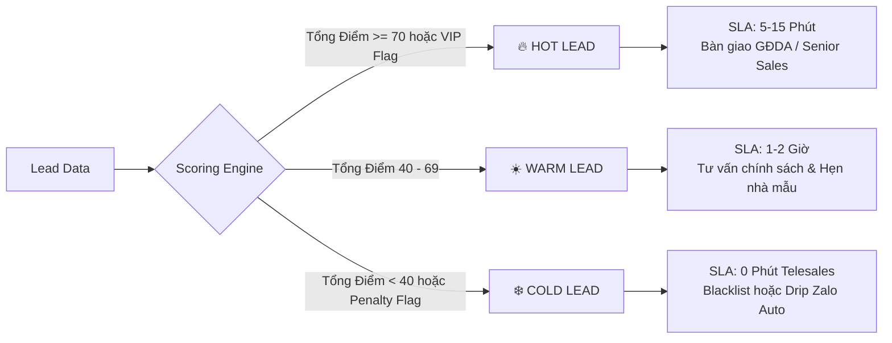

# Lead Scoring Skill — Chấm Điểm & Phân Loại Khách Hàng Bất Động Sản

> **Kỹ năng chuẩn hóa cho Sales Ops, Business Analyst & Đội ngũ Môi giới Bất Động Sản**  
> *Được tối ưu hóa cho hệ thống Agentic AI trong việc phân tích ngôn ngữ tự nhiên (NLP) từ mô tả nhu cầu, tính điểm chuẩn xác và chuyển giao dữ liệu tức thì cho đội ngũ Sales.*

---

## 1. Định Nghĩa Lead Scoring & Tại Sao Quan Trọng Trong BĐS?

### 1.1. Định nghĩa Lead Scoring
**Lead Scoring (Chấm điểm khách hàng tiềm năng)** trong ngành Bất Động Sản là phương pháp định lượng hóa mức độ sẵn sàng giao dịch (Sales-readiness) và giá trị tiềm năng của khách hàng bằng một điểm số cụ thể. Điểm số này được tính toán dựa trên sự kết hợp giữa:
1. **Dữ liệu nhân khẩu học & tài chính (Explicit Data):** Khả năng tài chính, ngành nghề, vị thế xã hội (Chủ doanh nghiệp, Nhà đầu tư...).
2. **Dữ liệu hành vi & nhu cầu (Implicit & Contextual Data):** Phân khúc sản phẩm mong muốn (Biệt thự, Penthouse, Đất nền, Căn hộ), tính cấp thiết (cần mua ngay, xem nhà cuối tuần), và mức độ tương tác (sẵn sàng gặp mặt đàm phán vs thuê bao/không bắt máy).

### 1.2. Tại sao Lead Scoring là "Vũ Khí Sống Còn" trong BĐS?
Bất động sản là ngành hàng giá trị cực cao với chu kỳ bán hàng kéo dài và chi phí tìm kiếm khách hàng (CPA) rất đắt đỏ. Lead Scoring giải quyết 4 bài toán kinh điển:

1. **Quy luật Pareto (80/20) — Tối ưu hóa 70% thời gian của Sales:**
   - 80% doanh thu đến từ 20% khách hàng chất lượng cao (VIP/Thực tế).
   - Loại bỏ ngay 40-50% số rác (sai số, spam bảo hiểm, đòi mua nhà Q1 giá 1 tỷ), giúp Telesales không bị kiệt sức (burn-out) vì gọi vào những cuộc gọi vô vọng.
2. **Nắm bắt "Thời gian vàng" (Speed-to-Lead):**
   - Nghiên cứu từ MIT & Harvard Business Review chỉ ra rằng: Khách hàng được liên hệ trong vòng **5 - 15 phút** đầu tiên có xác suất chốt hẹn và giao dịch cao gấp **4 đến 8 lần** so với việc liên hệ sau 1 giờ. Lead Scoring giúp định tuyến tự động các deal "triệu đô" đến ngay các Top Sales (Super Closer).
3. **Cá nhân hóa kịch bản tiếp cận (Context-aware Pitching):**
   - Không thể dùng cùng một kịch bản bán căn hộ trả góp để gọi cho một Chủ tịch đang săn Penthouse ven sông. Chấm điểm đi kèm bóc tách Insight giúp Sales mở đầu cuộc gọi trúng tâm lý (Pain Points & Desires) của khách hàng.
4. **Hàn gắn mâu thuẫn Marketing - Sales:**
   - Tạo ra định nghĩa chuẩn mực (SLA) về thế nào là Lead đạt chuẩn (Marketing Qualified Lead - MQL vs Sales Qualified Lead - SQL).

---

## 2. Quy Trình Chấm Điểm 5 Tiêu Chí Nghiệp Vụ Chuẩn

Hệ thống tính điểm kết hợp giữa **Thang điểm cơ sở 100 điểm** trên 5 tiêu chí cốt lõi và **Quy tắc Đòn bẩy Nghiệp vụ (+/- 50 điểm)** từ bộ kiến thức nội bộ [`knowledge-base/tieu_chi_cham_diem.txt`](file:///Users/ThienTuCorp/Desktop/Agenetic%20AI%202026/my-workspace/knowledge-base/tieu_chi_cham_diem.txt).

```
Tổng Điểm = Điểm Cơ Sở (Tối đa 100) + Thưởng VIP (+50) - Phạt Rác (-50)
```

### Chi tiết 5 Tiêu chí:

| Tiêu chí | Trọng số | Tiêu chuẩn đánh giá & Thang điểm cơ sở | Dấu hiệu đặc biệt (Quy tắc +/- 50 điểm) |
|---|:---:|---|---|
| **1. Ngân sách (Budget)** | **30%** | • **>= 20 tỷ:** 30 điểm<br>• **8 - 10 tỷ:** 25 điểm<br>• **4 - 5 tỷ (vay 70%):** 18 điểm<br>• **2 - 3 tỷ (đất nền):** 15 điểm<br>• Thuê spa (<50tr/th): 12 điểm<br>• Dưới 1 tỷ hoặc không rõ: 5 điểm | **+50đ Thưởng VIP:** Tài chính từ 20 tỷ trở lên, thanh toán thẳng, "tài chính mạnh", "không thành vấn đề".<br>**-50đ Phạt Rác:** Yêu cầu phi thực tế (đòi mua nhà Quận 1 giá 1-2 tỷ, thuê trung tâm 2 triệu/tháng). |
| **2. Nhu cầu & Loại hình (Need / Product Fit)** | **25%** | • **Cao cấp / Hạng sang:** Penthouse hồ bơi riêng, Biệt thự đơn lập ven sông, Quỹ đất công nghiệp > 2000m2, Sàn VP lớn: 25 điểm<br>• **Phổ thông / Trung cao:** Nhà phố nội thành, Căn hộ gia đình 2PN: 20 điểm<br>• **Kinh doanh / Đất nền:** Mặt bằng spa, Đất nền sổ đỏ vùng ven: 16 điểm | **+50đ Thưởng VIP:** Tìm kiếm sản phẩm độc bản, Shophouse mặt đường lớn, yêu cầu pháp lý chuẩn 100%, sổ hồng riêng.<br>**-50đ Phạt Rác:** Không có nhu cầu BĐS, dữ liệu cũ trộn vào, spam mời chào bảo hiểm/vay vốn. |
| **3. Thời gian mua (Timeline / Urgency)** | **20%** | • **Mua ngay / Cấp thiết:** Muốn xem nhà mẫu cuối tuần này, cần ký hợp đồng thuê dài hạn ngay: 20 điểm<br>• **Đang cân nhắc:** Đang so sánh 2 dự án, cần tư vấn chính sách chiết khấu để chốt: 15 điểm<br>• **Dài hạn:** Đầu tư đất nền dài hạn (1-3 năm): 10 điểm | **-50đ Phạt Rác:** Tuyên bố rõ "Hỏi giá cho vui", "Chưa có ý định mua trong năm nay". |
| **4. Nguồn khách & Vị thế (Authority / Profile)** | **15%** | • **VIP C-Level / Sỉ:** Chủ doanh nghiệp lớn, Nhà đầu tư chuyên nghiệp gom sỉ 5-10 căn, khách mua nhiều dự án cũ của tập đoàn: 15 điểm<br>• **Gia đình / Hộ kinh doanh:** Gia đình trẻ, chủ cơ sở spa: 10 điểm<br>• **Cá nhân tự do:** 5 điểm | **+50đ Thưởng VIP:** Vị thế Chủ tịch/Chủ doanh nghiệp, mua sỉ số lượng lớn, yêu cầu gặp trực tiếp Giám đốc dự án hoặc Chủ đầu tư. |
| **5. Tương tác & Khả năng kết nối (Engagement / Contactability)** | **10%** | • **Chủ động cao:** Muốn gặp trực tiếp đàm phán, đi xem thực tế: 10 điểm<br>• **Tương tác chuẩn:** Yêu cầu tư vấn chính sách, gửi layout: 7 điểm<br>• **Thụ động:** Phản hồi chậm: 3 điểm | **-50đ Phạt Rác:** Số điện thoại thuê bao liên tục, gọi nhiều lần không bắt máy, nhắn tin Zalo không phản hồi, thái độ bất hợp tác. |

---

## 3. Cách Phân Loại HOT / WARM / COLD

Dựa trên tổng điểm cuối cùng, hệ thống tự động phân loại khách hàng thành 3 nhóm tác chiến:



### 3.1. 🔥 HOT LEADS (Điểm >= 70 hoặc có cờ VIP +50đ)
- **Đặc điểm:** Tài chính cực mạnh (20 - 50+ tỷ hoặc thanh toán thẳng 100%), nhắm vào phân khúc khan hiếm (Penthouse, Biệt thự ven sông, Gom sỉ 5-10 Shophouse, Đất công nghiệp > 2000m2). Tính quyết đoán cao, yêu cầu pháp lý tuyệt đối chuẩn và muốn làm việc trực tiếp với cấp quyết định (Chủ đầu tư/Giám đốc dự án).
- **Hành động & Phân quyền:**
  - **SLA:** Tiếp cận trong vòng **5 - 15 phút**.
  - **Phân công:** Chuyển thẳng cho Giám đốc Khối, Giám đốc Dự án hoặc Top 5% Senior Sales có kinh nghiệm tiếp khách thượng lưu.
  - **Chiến lược:** Chuẩn bị tài liệu riêng tư (Private Deck), hồ sơ pháp lý công chứng, đề xuất xe riêng đón khách khảo sát thực địa.

### 3.2. ☀️ WARM LEADS (Điểm từ 40 đến 69 điểm)
- **Đặc điểm:** Có nhu cầu ở thực hoặc đầu tư bền vững nhưng cần hỗ trợ tài chính hoặc cân nhắc đòn bẩy:
  - Căn hộ 2PN Quận 7 (4-5 tỷ, cần vay 70%, muốn xem nhà mẫu cuối tuần).
  - Nhà phố liền kề nội thành (8-10 tỷ, đang so sánh 2 dự án, cần chính sách chiết khấu).
  - Đất nền vùng ven (Long An, Đồng Nai 2-3 tỷ, cần sổ hồng riêng).
  - Mặt bằng spa kinh doanh tại Quận 1 (<50 triệu/tháng, hợp đồng dài hạn).
- **Hành động & Phân quyền:**
  - **SLA:** Tiếp cận trong vòng **1 - 2 giờ** làm việc.
  - **Phân công:** Đội ngũ Sales chính thức (Account Executives / Telesales chuyên nghiệp).
  - **Chiến lược:** Gửi bảng tính lãi suất vay ngân hàng chi tiết theo tháng, gửi bảng so sánh ưu đãi chiết khấu, chốt lịch hẹn tham quan nhà mẫu vào cuối tuần.

### 3.3. ❄️ COLD LEADS (Điểm < 40 hoặc có cờ Phạt -50đ)
- **Đặc điểm:** Khách hàng không có khả năng chuyển đổi hoặc gây hại cho năng suất của đội ngũ:
  - Nhầm số, dữ liệu cũ trộn lẫn từ ngành khác.
  - Spam, gọi đến quảng cáo ngược dịch vụ bảo hiểm/vay vốn.
  - Nhu cầu phi thực tế: Đòi mua nhà Quận 1 giá 1 tỷ, thuê nhà nguyên căn trung tâm giá 2 triệu.
  - Thái độ không hợp tác, hỏi giá cho vui, số điện thoại thuê bao gọi nhiều lần không nghe máy, không rep Zalo.
- **Hành động & Phân quyền:**
  - **SLA:** **0 phút** thời gian gọi trực tiếp của Sales.
  - **Xử lý:** Tự động gắn tag `Unqualified / Junk / Spam`, đưa vào danh sách đen (Blacklist) hoặc đưa vào luồng Drip Marketing tự động gửi tin nhắn giới thiệu thị trường định kỳ 3-6 tháng qua Zalo ZNS/SMS với chi phí tối thiểu.

---

## 4. Lưu Ý Quan Trọng Khi AI Chấm Điểm Tự Động (Giới Hạn & Rủi Ro)

Việc áp dụng AI (LLM / Natural Language Processing) để chấm điểm tự động mang lại tốc độ vượt trội nhưng tiềm ẩn các rủi ro hệ thống nếu không có cơ chế kiểm soát:

### 4.1. Ảo giác và suy diễn quá đà (Hallucination & Over-inference)
- **Rủi ro:** Khi mô tả ngắn gọn (VD: *"cần mua căn hộ 2pn"*), AI có thể tự suy diễn khách có tài chính 10 tỷ nếu không được gông kìm (prompt constraints) chặt chẽ.
- **Giải pháp:** Áp dụng nguyên tắc **Evidence-based Scoring** (Chấm điểm dựa trên bằng chứng thực tế). Chỉ cộng điểm tài chính khi có số liệu cụ thể hoặc từ khóa tường minh. Nếu thiếu thông tin, gán mức điểm trung vị an toàn (Neutral Score).

### 4.2. Hiện tượng "Đại gia kín tiếng" vs "Khách nổ"
- **False Negative (Bỏ sót khách VIP):** Nhiều đại gia thực sự thường nhắn tin rất cộc lốc: *"inbox giá penthouse"* hoặc *"add zalo gửi layout"*. Nếu AI chấm điểm máy móc dựa trên độ dài câu chữ thì có thể đánh rớt họ vào nhóm Cold.
  - *Biện pháp:* Bất kỳ từ khóa nào chạm vào sản phẩm siêu cao cấp (`Penthouse`, `Biệt thự ven sông`, `Shophouse`) phải lập tức được kích hoạt cờ kiểm tra ưu tiên.
- **False Positive (Khách nổ / Giả lập VIP):** Một số đối tượng sử dụng ngôn từ khoa trương nhưng thực tế không có khả năng chứng minh tài chính.
  - *Biện pháp:* Khâu xác thực bước 1 qua điện thoại phải luôn có câu hỏi kiểm chứng nhẹ nhàng về khả năng thanh toán.

### 4.3. Bảo vệ dữ liệu nhạy cảm (PII & An toàn thông tin)
- **Rủi ro:** Lộ lọt số điện thoại, danh tính của các yếu nhân, chủ doanh nghiệp khi gửi dữ liệu lên các nền tảng AI đám mây công cộng.
- **Giải pháp:** Tuân thủ Quy tắc 5 của `AGENTS.md`. Luôn hỗ trợ cơ chế Masking SĐT (VD: `0953***436`) trong quá trình xử lý prompt nếu làm việc với API công khai, hoặc chạy trên môi trường cục bộ/Private Endpoint.

### 4.4. Giám sát & Can thiệp của Con Người (Human-in-the-Loop & Feedback Loop)
- AI chỉ đóng vai trò **Bộ lọc thông minh sơ bộ (Co-pilot)**, không thay thế hoàn toàn quyết định kinh doanh.
- Thiết kế trường dữ liệu `sales_feedback_status` (`Verified Hot`, `Downgraded to Warm`, `Marked as Spam`) để Sales phản hồi lại sau cuộc gọi đầu tiên, từ đó liên tục tinh chỉnh bộ từ khóa và trọng số.

---

## 5. Giao Thức Bàn Giao Kết Quả Cho Sales (Handover Protocol & SLA)

### 5.1. Cam Kết Thời Gian Vàng (Speed-to-Lead SLA Table)

| Phân hạng | Thời gian phản hồi cam kết (SLA) | Kênh tiếp cận | Người phụ trách |
|---|:---:|:---:|:---:|
| **HOT LEAD** | **<= 15 phút** (Khuyến nghị 5 phút) | Gọi trực tiếp + Kết bạn Zalo gửi Private Deck | Giám đốc DA / Senior Broker |
| **WARM LEAD** | **<= 2 giờ** trong ngày làm việc | Gọi điện thoại tư vấn + Gửi bảng tính vay | Chuyên viên Kinh doanh (AE) |
| **COLD LEAD** | N/A (Tự động hóa) | Email Drip Campaign / Zalo ZNS nuôi dưỡng | Hệ sinh thái Marketing Tự động |

### 5.2. Cấu Trúc Thẻ Bàn Giao Thông Minh (Lead Intelligence Card)
Mỗi khách hàng sau khi được AI chấm điểm sẽ được tạo một thẻ bàn giao ngắn gọn gửi vào Telegram/CRM của Sales:

```markdown
======================================================================
🔥 [HOT LEAD] - ĐIỂM: 95/100 | THƯỞNG VIP (+50)
----------------------------------------------------------------------
👤 KHÁCH HÀNG: Trần Hoàng Dũng | 📞 SĐT: 0943 392 982
🏢 VỊ THẾ: Chủ doanh nghiệp lớn
🎯 NHU CẦU: Tìm quỹ đất công nghiệp hoặc sàn văn phòng > 2000m2 tại Khu Đông.
💰 TÀI CHÍNH: Cực mạnh, yêu cầu pháp lý chuẩn 100%.
⏱️ TÍNH CẤP THIẾT: Muốn đàm phán ngay.

💡 SALES OPENER PITCH (Gợi ý câu mở đầu cuộc gọi):
"Dạ em chào anh Dũng, em là [Tên Sales] - Phụ trách phân khúc Bất động sản
Thương mại & Công nghiệp của [Tập đoàn]. Nhận được yêu cầu tìm kiếm sàn
văn phòng/quỹ đất trên 2000m2 chuẩn pháp lý của anh tại Khu Đông, em đã
chuẩn bị sẵn hồ sơ 2 quỹ đất có sổ đỏ hoàn chỉnh và trích lục quy hoạch
1/500 trực tiếp từ chủ đầu tư. Chiều nay em xin phép mang hồ sơ qua văn
phòng công ty mình để gửi anh xem trước được không ạ?"
======================================================================
```

---

## 6. Hướng Dẫn Sử Dụng Kỹ Năng Tự Động Hóa

### 6.1. Chạy chấm điểm tự động từ Terminal
Skill được tích hợp sẵn công cụ tự động hóa Python trong thư mục `scripts/`:

```bash
# Chấm điểm trực tiếp từ link Google Sheet chính thức:
python3 .agents/skills/lead-scoring/scripts/score_leads.py

# Hoặc truyền file CSV/Excel tùy chỉnh:
python3 .agents/skills/lead-scoring/scripts/score_leads.py --input "sample-data/bds_leads_raw.csv"
```

### 6.2. Kết quả đầu ra (Deliverables)
1. **File kết quả chi tiết:** `outputs/reports/bds_leads_scored.csv` (Đầy đủ điểm 5 tiêu chí, phân loại HOT/WARM/COLD và kịch bản mở đầu).
2. **Báo cáo điều hành:** `outputs/reports/lead_scoring_bds_analysis.md` (Phân tích tỷ lệ chuyển đổi, danh sách Top Lead ưu tiên và danh sách lọc rác).
