# Brainstorm Decision Brief (AI4A) — Quy Trình Tính Lương & Phân Tích Quỹ Lương Nhân Sự Cấp Cao (Ngành Di Trú & Tư Vấn Định Cư)

**Dự án / Chủ đề:** Thiết Kế Quy Trình Tính Lương Cấp Cao, Sinh Dữ Liệu 24 Tháng & Phân Tích Quỹ Lương Ngành Di Trú  
**Ngày thực hiện:** 13/09/2026  
**Khung tham chiếu:** AI4A Brainstorm Contract (`ai4a:brainstorm`) kết hợp Framework `--oipo`  
**Cố vấn chuyên môn:** MT Đức Thuận & Chuyên gia Phân tích Vận hành / C&B Doanh nghiệp Di trú  

---

## 1. The 4-Field Contract (Khế Ước 4 Thành Phần)

| Thành phần | Đặc tả chi tiết |
|:---|:---|
| **1. Outcome (Kết quả đầu ra)** | • Bộ tài liệu quy chế tính lương & đãi ngộ nhân sự cấp cao ngành di trú chuẩn hóa. • Bộ dữ liệu mẫu 24 tháng (2024-10 đến 2026-09) của 12 nhân sự cấp cao (288 records) tại `sample-data/Executive_Payroll_24Months_Raw.xlsx`. • Master Dashboard Excel tích hợp biểu đồ trực quan và thẻ KPI tại `outputs/reports/Executive_Payroll_Master_Dashboard.xlsx`. • Bản Báo cáo Đánh giá Tổng quan Quỹ Lương & Đề xuất Chiến lược gửi Tổng Giám Đốc/Sếp tại `outputs/reports/executive_payroll_analysis_report.md`. |
| **2. Constraints (Ràng buộc thực tế)** | • Tuân thủ chính xác biểu thuế TNCN lũy tiến 7 bậc của Việt Nam và trần đóng BHXH/BHYT/BHTN (theo mức trần 20 lần lương cơ sở). • Phản ánh đúng đặc thù ngành di trú: Chu kỳ thụ lý hồ sơ kéo dài (12-36 tháng), phí dịch vụ cao ($20,000 - $70,000 USD/deal), tính chất mùa vụ và rủi ro nhân sự bỏ rơi hồ sơ khi gặp RFE/NOID. • Phân định rõ Lương Gross, Net, Chi phí thực tế doanh nghiệp (Total Cost) và quỹ giữ lại (Retention Escrow). |
| **3. Non-goals (Ngoài phạm vi)** | • Không can thiệp vào phân hệ tính lương của toàn bộ nhân viên cấp dưới (chỉ tập trung vào 12 nhân sự lãnh đạo/C-level/Giám đốc khối). • Không kết nối API trực tiếp vào tài khoản ngân hàng chi trả tiền thật (đây là pipeline phân tích quản trị nội bộ). • Không thay thế tư vấn pháp lý luật sư di trú về cấu trúc hồ sơ khách hàng. |
| **4. Acceptance Criteria (Tiêu chí nghiệm thu)** | • Dữ liệu 288 dòng đầy đủ 100%, không khuyết thiếu, nhất quán toán học (`Gross = Base + Allowance + KPI + Commission + Retention`; `Net = Gross - BHXH - PIT`). • File Excel Master Dashboard có 4 sheet, định dạng số tiền VNĐ chuyên nghiệp, có ít nhất 3 biểu đồ trực quan (Trend, Breakdown by Role, Pay-mix). • Báo cáo gửi Sếp nêu bật ít nhất 4 chỉ số tài chính quản trị (Tổng quỹ lương, PRR - Payroll to Revenue Ratio, Pay-mix Fixed/Variable, HC-ROI) và 4 đề xuất hành động cụ thể. |

---

## 2. OIPO Workflow Specification (Đặc Tả Quy Trình OIPO)

```mermaid
flowchart LR
    subgraph INPUT["INPUT (Dữ Liệu Đầu Vào)"]
        I1["12 Hồ sơ Nhân sự Cấp cao<br>(Role, Base, Tier, K)"]
        I2["24 Tháng Hoạt động<br>(Doanh số Deal, Điểm KPI, Escrow)"]
        I3["Quy tắc Thuế & BHXH<br>(PIT 7 bậc, Mức trần BHXH)"]
    end

    subgraph PROCESS["PROCESS (Xử Lý 4 Bước)"]
        P1["Bước 1: Ingestion & Target Synthesis<br>Sinh 288 records thực tế có mùa vụ"]
        P2["Bước 2: Payroll & Tax Calculation<br>Tính KPI, Override, Escrow, PIT, Net"]
        P3["Bước 3: Fund Analytics Engine<br>Tính PRR, Pay-mix, HC-ROI, Trends"]
        P4["Bước 4: Human Checkpoint / Audit<br>Đối soát bất thường & trần ngân sách"]
    end

    subgraph OUTPUT["OUTPUT (Đầu Ra Quản Trị)"]
        O1["sample-data/<br>Executive_Payroll_24Months_Raw.xlsx"]
        O2["outputs/reports/<br>Executive_Payroll_Master_Dashboard.xlsx"]
        O3["outputs/reports/<br>executive_payroll_analysis_report.md"]
        O4["docs/<br>pdca-log.md"]
    end

    INPUT --> PROCESS --> OUTPUT
```

### Chi tiết các thành phần OIPO:

### 1. Objective (Mục tiêu kinh doanh)
Tối ưu hóa quy trình tính lương và quản trị quỹ lương nhân sự cấp cao trong ngành Di trú & Tư vấn định cư (EB-5, Golden Visa, SUV, CBI) nhằm:
- Thu hút và giữ chân nhân tài điều hành hàng đầu (Legal Directors, Senior BD, HNWI Managers).
- Kiểm soát trần quỹ lương trên doanh thu dịch vụ (Payroll-to-Revenue Ratio) ở ngưỡng an toàn 10% - 15%.
- Xóa bỏ rủi ro "nhận hoa hồng xong nghỉ việc" thông qua cơ chế giải ngân thưởng duy trì theo cột mốc visa (Retention Escrow).

### 2. Input (Dữ liệu đầu vào)
- **Danh mục 12 Nhân sự cấp cao:**
  1. `EMP001` - Nguyễn Quốc Hùng: Tổng Giám Đốc (Managing Director / CEO)
  2. `EMP002` - Trần Minh Tuấn: Phó TGĐ Phát Triển Kinh Doanh (Deputy CEO & Head of BD)
  3. `EMP003` - Luật sư Lê Hoàng Nam: Giám Đốc Pháp Lý & Thụ Lý Hồ Sơ (Legal & Processing Director)
  4. `EMP004` - Phạm Thanh Hà: Giám Đốc Thẩm Định Đầu Tư & Dự Án (Investment Due Diligence Director)
  5. `EMP005` - Vũ Hải Đăng: Giám Đốc Khối Khách Hàng VIP (Private Clients / HNWI Director)
  6. `EMP006` - Đỗ Phương Thảo: Giám Đốc Marketing & Thương Hiệu (Chief Marketing Officer)
  7. `EMP007` - Hoàng Gia Bách: Giám Đốc Chi Nhánh Hà Nội (Regional Director - Northern Branch)
  8. `EMP008` - Ngô Thị Bích Ngọc: Giám Đốc Chi Nhánh TP.HCM (Regional Director - Southern Branch)
  9. `EMP009` - Trịnh Minh Trí: Trưởng Ban Đối Ngoại & Quan Hệ Lãnh Sự (Head of Consular Affairs)
  10. `EMP010` - Bùi Thanh Mai: Trưởng Bộ Phận Dịch Vụ An Cư (Head of Settlement Operations)
  11. `EMP011` - Đặng Văn Lâm: Giám Đốc Tài Chính Quốc Tế (Chief Financial Officer)
  12. `EMP012` - Võ Quỳnh Trang: Giám Đốc Nhân Sự & Tuân Thủ (HR & Compliance Director)
- **Chu kỳ thời gian:** 24 tháng liên tục (Tháng 10/2024 đến Tháng 09/2026).
- **Tham số thị trường:** Doanh số hợp đồng di trú (EB-5: $60,000 USD/deal, Golden Visa: $35,000 USD/deal, SUV: $40,000 USD/deal), biến động mùa vụ (cao điểm Q3-Q4, thấp điểm Q1 sau Tết).

### 3. Process (Các bước xử lý lõi)
- **Bước 1: Mô phỏng dữ liệu kinh doanh & vận hành (Synthetic Simulation)**
  - Sinh số lượng hợp đồng chốt mới, giá trị phí dịch vụ, tỷ lệ chấp thuận hồ sơ (Approval Rate), và số lượng hồ sơ được cấp Visa giải ngân Escrow.
- **Bước 2: Engine tính toán thu nhập (Earnings Engine)**
  - `Gross = Base_Salary + Allowance + KPI_Performance_Bonus + Commission_Override + Retention_Escrow_Release`.
- **Bước 3: Engine tính thuế & khấu trừ (Deductions & Tax Engine)**
  - `BHXH_Emp = Min(Base_Salary, Cap_BHXH) * 10.5%`.
  - `Taxable_Income = Gross - Non_Taxable_Allowances - BHXH_Emp - Personal_Relief (11M) - Dependent_Relief (4.4M * Số người)`.
  - Áp dụng biểu thuế TNCN 7 bậc tính ra Thuế TNCN chính xác.
  - `Net_Salary = Gross - BHXH_Emp - Thuế_TNCN`.
  - `Total_Company_Cost = Gross + BHXH_Company (21.5% * Cap_BHXH) + Executive_Benefits`.
- **Bước 4: Phân tích & Kiểm toán Quỹ Lương (Fund Analytics & Human Checkpoint)**
  - Tính PRR (Payroll-to-Revenue Ratio), cơ cấu Fixed vs Variable, so sánh hiệu quả giữa các khối (Sales, Legal, Operations, Management).

### 4. Output (Đầu ra tiêu chuẩn)
- `sample-data/Executive_Payroll_24Months_Raw.xlsx` & `.csv`: Dữ liệu gốc 288 dòng.
- `outputs/reports/Executive_Payroll_Master_Dashboard.xlsx`: File Excel quản trị gồm 4 sheet chuyên nghiệp.
- `outputs/reports/executive_payroll_analysis_report.md`: Báo cáo trình Sếp đầy đủ số liệu và kiến nghị.

---

## 3. Approach Comparison (So Sánh 3 Phương Án Kiến Trúc)

| Tiêu chí so sánh | Phương án 1: Lean Python Pipeline (Khuyến nghị) | Phương án 2: Agentic Multi-Role Workflow | Phương án 3: Enterprise HRIS / BI System |
|:---|:---|:---|:---|
| **Kiến trúc** | Script Python thuần với pandas & openpyxl, tính toán toán học chính xác 100%, xuất Excel & Markdown trực tiếp. | Đội nhóm Agent đa tác vụ (Data Agent -> Tax Agent -> Audit Agent -> Executive Reporter) có trạm kiểm duyệt con người. | Triển khai phần mềm nhân sự chuyên dụng (Workday/BambooHR) tích hợp CRM Salesforce và PowerBI qua API. |
| **Thời gian triển khai** | **Nhanh nhất (1-2 giờ)**, chạy offline độc lập, dễ debug và kiểm tra công thức. | Trung bình (1-2 ngày), tốn thêm token LLM cho các bước tính toán số học. | Rất lâu (2-6 tháng), chi phí bản quyền phần mềm và phí tư vấn cao. |
| **Độ chính xác toán học** | Tuyệt đối (100% Deterministic qua thuật toán Python). | Tiềm ẩn sai số làm tròn nếu để LLM tự tính toán số học lớn. | Tuyệt đối. |
| **Độ linh hoạt / Tùy biến** | Dễ dàng thay đổi dải lương, công thức hoa hồng, tỷ lệ Escrow ngay trong mã nguồn. | Tốt, dễ thay đổi văn phong báo cáo qua prompt. | Kém linh hoạt, mỗi lần đổi chính sách phải cấu hình lại hệ thống ERP. |
| **Key Assumption** | Dữ liệu đầu vào tuân thủ đúng schema cấu trúc bảng. | LLM tuân thủ chặt chẽ định dạng JSON/CSV trung gian giữa các agent. | Doanh nghiệp sẵn sàng đầu tư ngân sách lớn và có đội ngũ IT vận hành. |
| **First Failure Point** | Nếu công thức thuế hoặc định dạng file excel bị thay đổi đột ngột. | Handoff bị đứt gãy do độ dài context window hoặc hallucination số liệu. | API kết nối CRM/ERP bị gián đoạn hoặc lỗi đồng bộ dữ liệu. |

---

## 4. Recommendation & Next Action

- **Phương án lựa chọn:** **Phương án 1 (Lean Python Pipeline)** kết hợp tạo báo cáo phân tích Markdown & Excel Dashboard chuyên nghiệp.
- **Lý do:** Trong bài toán tính lương và quỹ lương, **độ chính xác số học là tối thượng** (không thể chấp nhận sai số thuế TNCN hay lương Net). Một pipeline Python tính toán xác định (deterministic) đảm bảo chuẩn xác từng đồng, đồng thời tạo ra đầy đủ cả dữ liệu raw, dashboard trực quan và báo cáo quản trị cấp cao.
- **Hành động tiếp theo:** Sau khi học viên/Sếp duyệt Implementation Plan, kích hoạt script sinh dữ liệu 24 tháng, tính toán bảng lương và xuất báo cáo hoàn chỉnh.
