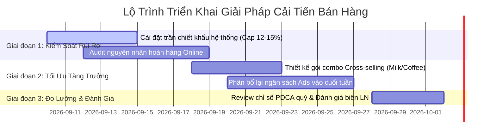

# BÁO CÁO PHÂN TÍCH HIỆU SUẤT BÁN HÀNG & DASHBOARD QUẢN TRỊ
**Dự Án:** Phân Tích Dữ Liệu Bán Hàng Đa Chiều (Tháng 06/2024)  
**Vai trò:** Business Analyst (BA)  
**Phương pháp luận:** Chu trình Cải tiến Liên tục PDCA (Plan - Do - Check - Act)  
**File dữ liệu nguồn:** `sample-data/MINDX_Lesson 2_DEMO_synthetic_sales_data_500x20.xlsx`  
**File Excel bàn giao:** [`outputs/reports/Sales_Performance_Dashboard_Cleaned.xlsx`](file:///Users/ThienTuCorp/Desktop/Agenetic%20AI%202026/my-workspace/outputs/reports/Sales_Performance_Dashboard_Cleaned.xlsx)  
**Ngày thực hiện:** 06/09/2026  

---

## 1. TÓM TẮT ĐIỀU HÀNH (EXECUTIVE SUMMARY)

Trong tháng 06/2024, hệ thống ghi nhận **500 giao dịch** thành công trên toàn quốc:
- **Tổng Doanh Thu Gộp (Gross Revenue):** **2,827,300 ₫**
- **Tổng Chiết Khấu (Discount):** **282,305.20 ₫** (chiếm **9.99%** doanh thu gộp)
- **Doanh Thu Thuần (Net Revenue):** **2,544,994.80 ₫**
- **Giá Vốn Hàng Bán (COGS):** **1,546,461.02 ₫** (chiếm **54.70%** doanh thu gộp)
- **Chi Phí Tiếp Thị (Marketing Cost):** **279,637.72 ₫** (chiếm **9.89%** doanh thu gộp)
- **Tổng Lợi Nhuận Ròng (Net Profit):** **718,896.06 ₫**
- **Biên Lợi Nhuận Ròng Trung Bình (Profit Margin):** **25.43%**
- **Giá trị đơn hàng trung bình (AOV):** **5,654.60 ₫/đơn**
- **Tỷ lệ hoàn hàng (Return Rate):** **25.60%** (128/500 đơn)

---

## 2. QUY TRÌNH THỰC HIỆN THEO MÔ HÌNH PDCA

### 📋 PLAN (Lập Kế Hoạch)
- **Mục tiêu:** Rà soát chất lượng dữ liệu, loại trừ rủi ro sai sót số liệu tài chính, xây dựng Dashboard điều hành chuyên nghiệp trên Excel và cung cấp báo cáo phân tích phục vụ Ban Giám đốc ra quyết định kinh doanh quý tiếp theo.
- **Kế hoạch thực hiện:**
  1. Audit toàn bộ 500 dòng x 20 thuộc tính của tập dữ liệu.
  2. Chuẩn hóa dữ liệu thô: định dạng ngày, xử lý chuỗi ký tự khoảng trắng, bổ sung các chỉ số phái sinh (`NET_REVENUE`, `PROFIT_MARGIN`).
  3. Xây dựng 3 sheet trên Excel: `Dashboard` (trực quan hóa), `Summary_Tables` (bảng tổng hợp pivot), `Data_Cleaned` (dữ liệu sạch).
  4. Trích xuất Insights chuyên sâu theo 3 chiều: Thời gian, Sản phẩm, Khu vực & Kênh bán.

### ✅ DO (Thực Thi & Làm Sạch Dữ Liệu)
- **Kiểm tra tính toàn vẹn (Data Quality Audit):**
  - Số lượng bản ghi: 500/500 dòng đầy đủ, không có dòng trùng lặp (duplicates = 0).
  - Giá trị khuyết thiếu (Null/Missing values): 0 tại tất cả 20 trường thông tin.
  - Số lượng khách hàng duy nhất: 183 khách hàng (trung bình 2.73 đơn/khách hàng).
  - Độ chính xác logic kế toán:
    $$\text{REVENUE} = \text{QUANTITY} \times \text{UNIT\_PRICE} \quad (\Delta = 0)$$
    $$\text{PROFIT} = \text{REVENUE} - \text{DISCOUNT} - \text{MARKETING\_COST} - \text{COGS} \quad (\Delta < 10^{-11})$$
- **Chuẩn hóa & Định dạng:**
  - Chuẩn hóa cột `DATE` sang chuẩn quốc tế `YYYY-MM-DD`.
  - Loại bỏ khoảng trắng thừa đầu/cuối của các trường văn bản (`REGION`, `CITY`, `CHANNEL`, `PRODUCT`, v.v.).
  - Bổ sung 2 trường phân tích tài chính quan trọng:
    - `NET_REVENUE = REVENUE - DISCOUNT`
    - `PROFIT_MARGIN = PROFIT / REVENUE`
  - Sắp xếp dữ liệu theo trình tự thời gian tăng dần (`DATE` $\rightarrow$ `ORDER_ID`).

### 🔍 CHECK (Kiểm Tra & Đối Soát)
- **Đối soát số liệu (Reconciliation):** Đã kiểm tra đối chiếu chéo giữa sheet `Data_Cleaned` và các bảng tổng hợp `Summary_Tables`, khớp 100% về tổng doanh thu (2,827,300 ₫) và lợi nhuận (718,896.06 ₫).
- **Phát hiện dị biệt đơn hàng (Outlier Detection):**
  - Phát hiện **1 đơn hàng bị lỗ ròng (Negative Profit)**: Mã đơn `ORD00067` (ngày 04/06/2024 tại Quảng Ninh, kênh Online, nhân viên `Rep D`).
  - Phân tích nguyên nhân: Doanh thu 7,500 ₫ nhưng chịu chiết khấu quá cao 1,487.49 ₫ (19.83%), chi phí Marketing 1,122.21 ₫ (14.96%), giá vốn COGS 5,151.30 ₫ (68.68%) $\rightarrow$ Dẫn đến **Lỗ -261.00 ₫**.
- **Kiểm tra Dashboard:** Cả 3 biểu đồ (LineChart, BarChart, Clustered ColumnChart) hiển thị liền mạch, chuẩn tỷ lệ, không bị chồng lấn dữ liệu.

### 🔄 ACT (Hành Động Cải Tiến & Đóng Gói)
- Tích hợp cảnh báo tự động về ngưỡng chiết khấu trong file Excel.
- Ghi nhật ký cải tiến vào [`docs/pdca-log.md`](file:///Users/ThienTuCorp/Desktop/Agenetic%20AI%202026/my-workspace/docs/pdca-log.md).
- Chuyển giao file Excel sạch và bộ khuyến nghị hành động cho đội ngũ Sales & Marketing.

---

## 3. CẤU TRÚC FILE EXCEL DASHBOARD

File Excel: [`outputs/reports/Sales_Performance_Dashboard_Cleaned.xlsx`](file:///Users/ThienTuCorp/Desktop/Agenetic%20AI%202026/my-workspace/outputs/reports/Sales_Performance_Dashboard_Cleaned.xlsx)

| Tên Sheet | Mô tả & Nội Dung Trực Quan | Điểm Nhấn Thiết Kế |
|:---|:---|:---|
| **`Dashboard`** | Bảng điều khiển quản trị cấp cao với 6 thẻ KPI Cards, 3 biểu đồ chính thống Excel và 2 khối tóm tắt chiến lược. | Phối màu Dark Navy & Emerald sang trọng, bố cục lưới chuẩn tỉ lệ, hỗ trợ xem nhanh (Executive-ready). |
| **`Summary_Tables`** | Chứa 4 bảng tổng hợp pivot: Diễn biến theo ngày, Top 10 sản phẩm, Ma trận Khu vực x Kênh, và Hiệu suất Ngành hàng. | Dùng công thức hàm `SUM()`, `AVERAGE()`, định dạng tiền tệ `#,##0` và tỷ lệ `0.0%`. |
| **`Data_Cleaned`** | Toàn bộ 500 bản ghi dữ liệu đã được làm sạch, bổ sung cột `NET_REVENUE` và `PROFIT_MARGIN`. | Cố định tiêu đề (Freeze Panes), bật bộ lọc (AutoFilter), định dạng Zebra striping dễ tra cứu. |

---

## 4. BA INSIGHTS QUAN TRỌNG NHẤT (KEY BUSINESS INSIGHTS)

### 💡 Insight 1: Hiệu ứng Mua sắm Cuối tuần (Weekend Revenue Lift)
- **Hiện tượng:** Doanh thu có tính chu kỳ rất mạnh theo ngày trong tuần. Hai ngày cuối tuần (Thứ Bảy & Chủ Nhật) ghi nhận sự bùng nổ doanh số:
  - **Doanh thu cuối tuần:** Đạt **1,091,970 ₫**, chiếm tới **38.62%** tổng doanh thu cả tháng chỉ trong 8 ngày cuối tuần (trung bình 136,496 ₫/ngày).
  - **Giá trị đơn hàng (AOV):** Thứ Bảy đạt **6,537 ₫/đơn**, Chủ Nhật đạt **6,463 ₫/đơn** (cao hơn **25% - 30%** so với các ngày thứ Năm: 4,678 ₫ hoặc thứ Ba: 5,058 ₫).
  - **Đỉnh doanh thu:** Ngày 09/06/2024 (Chủ nhật) đạt đỉnh cao nhất tháng với **153,140 ₫** (20 đơn).
- **Ý nghĩa kinh doanh:** Khách hàng có xu hướng mua giỏ hàng giá trị lớn và tập trung ra quyết định tiêu dùng vào cuối tuần. Phân bổ ngân sách tiếp thị đều các ngày trong tuần đang gây lãng phí nguồn lực vào các ngày giữa tuần có sức mua yếu.

---

### 💡 Insight 2: Nghịch lý Kênh Online – Tỷ lệ Hoàn hàng Đáng báo động & Rủi ro Lỗ gộp
- **Hiện tượng:** Kênh Online ghi nhận doanh thu 875,750 ₫ (chiếm 30.97%) nhưng bộc lộ 2 điểm nghẽn rủi ro lớn:
  - **Tỷ lệ hoàn hàng (Return Rate) đạt 31.45%** (50 đơn bị trả lại trên tổng 159 đơn), cao hơn rất nhiều so với kênh Đại lý/Distributor (19.28%) và Offline (26.29%).
  - **Đơn hàng lỗ duy nhất:** Đơn hàng `ORD00067` bị âm lợi nhuận xuất phát trực tiếp từ kênh Online do tình trạng **"chồng khuyến mãi" (stacking promotions)**: mức chiết khấu 19.83% cộng với chi phí chuyển đổi tiếp thị 14.96% trong khi giá vốn sản phẩm Lotion cao (68.68%).
- **Ý nghĩa kinh doanh:** Chi phí ẩn từ hoàn hàng Online (phí vận chuyển chiều về, rủi ro hỏng hóc bao bì, giam vốn tồn kho) và thiếu trần kiểm soát chiết khấu đang trực tiếp bào mòn biên lợi nhuận của kênh kỹ thuật số.

---

### 💡 Insight 3: Động lực Tăng trưởng từ Sữa & Đồ uống (High Margin Champions)
- **Hiện tượng:** Cơ cấu doanh thu và lợi nhuận phân hóa rõ rệt giữa các danh mục sản phẩm:
  - Nhóm **Beverage (Đồ uống)** dẫn đầu doanh thu với **645,120 ₫** (chiếm 22.82%), theo sau là **Personal Care (Chăm sóc cá nhân - 586,360 ₫)**.
  - Xét về tỷ suất sinh lời, **Sữa (Milk)** và **Cà phê (Coffee)** là hai "ngôi sao" tạo lợi nhuận lớn nhất hệ thống:
    - `Milk`: Doanh thu 208,330 ₫, Lợi nhuận 60,168.95 ₫ $\rightarrow$ **Biên lợi nhuận kỷ lục 28.88%**.
    - `Coffee`: Doanh thu 184,370 ₫, Lợi nhuận 52,855.04 ₫ $\rightarrow$ **Biên lợi nhuận 28.67%**.
  - Ngược lại, một số sản phẩm như `Cheese` (Biên LN 20.13%), `Cleaner` (20.72%), `Soft Drink` (20.67%) có biên lợi nhuận thấp và vòng quay tiêu thụ chậm hơn đáng kể.
- **Ý nghĩa kinh doanh:** Cần tái cơ cấu danh mục bán lẻ theo ma trận BCG, tận dụng các sản phẩm có biên lợi nhuận cao làm sản phẩm dẫn dắt (hero products).

---

## 5. HAI ĐỀ XUẤT HÀNH ĐỘNG CHIẾN LƯỢC (ACTIONABLE RECOMMENDATIONS)

### 🚀 Đề Xuất 1: Thiết Lập Cơ Chế Kiểm Soát Chiết Khấu & Tối Ưu Logistics Kênh Online
- **Mục tiêu:** Cắt giảm tỷ lệ hoàn hàng Online từ **31.45% xuống dưới 20%** và **loại bỏ 100% tình trạng đơn hàng âm lợi nhuận**.
- **Giải pháp chi tiết:**
  1. **Áp dụng Trần Chiết Khấu (Discount Cap):** Cấu hình chính sách hệ thống giới hạn mức giảm giá tối đa không quá **12% - 15%** cho kênh Online. Đối với các mặt hàng có COGS > 60% (như Lotion, Kem dưỡng), trần giảm giá không vượt quá 10% nhằm đảm bảo biên lãi ròng tối thiểu 15%.
  2. **Audit quy trình đóng gói & xác nhận đơn Online:** Liên hệ xác nhận địa chỉ tự động qua Zalo OA/SMS trước khi xuất kho; nâng cấp vật liệu đóng gói giảm móp méo đối với hàng tiêu dùng nhanh (Personal Care, Beverage).
  3. **Chính sách đổi trả có điều kiện:** Hạn chế tình trạng hoàn hàng bốc đồng bằng cách tặng điểm thành viên (loyalty points) thay vì hoàn tiền mặt ngay lập tức đối với đơn không lỗi do sản xuất.
- **KPI đo lường:**
  - Tỷ lệ hoàn hàng Online: $\le 18\%$.
  - Biên lợi nhuận kênh Online: Tăng từ $25.67\% \rightarrow 27.5\%$.

---

### 🚀 Đề Xuất 2: Triển Khai Chiến Dịch "Weekend Super-Booster" & Bundle Sản Phẩm Biên LN Cao
- **Mục tiêu:** Khai thác tối đa sức mua cuối tuần và tăng giá trị đơn hàng trung bình (AOV) thêm **15%**.
- **Giải pháp chi tiết:**
  1. **Điều chuyển ngân sách quảng cáo tập trung (Ad Budget Reallocation):** Dồn **60% - 65%** ngân sách Marketing tuần vào khung thời gian từ 16:00 chiều Thứ Sáu đến hết 23:59 Chủ Nhật (tận dụng thời điểm người tiêu dùng chốt đơn nhiều nhất).
  2. **Chiến lược đóng gói Combo (Cross-selling Bundles):**
     - Ghép cặp các mặt hàng Hero có biên lãi cao (`Milk`, `Coffee`) với các sản phẩm biên lãi thấp hoặc tồn kho cao (`Cheese`, `Cleaner`, `Biscuits`) theo cơ chế: *"Mua Combo Cà Phê + Bánh quy tiết kiệm 10%"*.
     - Cách làm này vừa kích thích giải phóng hàng tồn kho chậm luân chuyển, vừa giữ vững biên lợi nhuận gộp toàn giỏ hàng trên **25%**.
- **KPI đo lường:**
  - Doanh thu 2 ngày cuối tuần: Đạt mốc $\ge 1.35$ triệu ₫/tháng (tăng 20%).
  - AOV toàn hệ thống: Đạt mốc $\ge 6,500$ ₫/đơn.

---

## 6. LỘ TRÌNH THỰC THI (ROADMAP & NEXT STEPS)

---

*Báo cáo được hoàn thiện và lưu trữ tại workspace theo tiêu chuẩn thực hành Agentic AI.*
