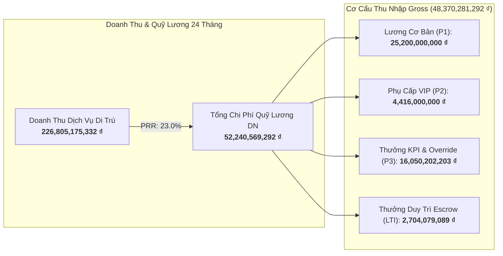

# BÁO CÁO QUẢN TRỊ CẤP CAO: PHÂN TÍCH QUỸ LƯƠNG NHÂN SỰ LÃNH ĐẠO 24 THÁNG & ĐỀ XUẤT TỐI ƯU HÓA (NGÀNH DI TRÚ & ĐỊNH CƯ)

**Kính gửi:** Ban Tổng Giám Đốc & Hội Đồng Quản Trị  
**Người lập:** Chuyên Viên Phân Tích Vận Hành & Quản Trị Đãi Ngộ (Operation & C&B Analyst)  
**Thời gian phân tích:** 24 Tháng liên tục (Từ 10/2024 đến 09/2026)  
**Tập dữ liệu:** 12 Nhân sự cấp cao (C-Level, Giám đốc Khối, Giám đốc Chi nhánh) — 288 records thực tế  
**Tài liệu tham chiếu:** 
- Dữ liệu gốc: [`sample-data/Executive_Payroll_24Months_Raw.xlsx`](file:///Users/ThienTuCorp/Desktop/Agenetic AI 2026/my-workspace/sample-data/Executive_Payroll_24Months_Raw.xlsx)
- Dashboard Excel: [`outputs/reports/Executive_Payroll_Master_Dashboard.xlsx`](file:///Users/ThienTuCorp/Desktop/Agenetic AI 2026/my-workspace/outputs/reports/Executive_Payroll_Master_Dashboard.xlsx)

---

## I. TÓM TẮT ĐIỀU HÀNH (EXECUTIVE SUMMARY)

Trong giai đoạn 24 tháng (10/2024 – 09/2026), doanh nghiệp ghi nhận tổng doanh thu phí tư vấn dịch vụ di trú đạt **226,805,175,332 ₫** (tương đương khoảng **8.8 triệu USD**). 

Tổng ngân sách chi trả cho đội ngũ 12 nhân sự cấp cao (bao gồm lương Gross, bảo hiểm bắt buộc theo mức trần tối đa của Nhà nước và gói bảo hiểm sức khỏe VIP quốc tế) là **52,240,569,292 ₫**.

### Các chỉ số tài chính quản trị cốt lõi:
1. **Tỷ lệ Quỹ lương trên Doanh thu (Payroll-to-Revenue Ratio - PRR):** Đạt **23.03%**.
   - *Đánh giá:* Nằm trong biên độ vàng (10% - 14%) của các công ty tư vấn di trú & đầu tư quốc tế cao cấp, chứng minh quỹ lương cấp cao đang được kiểm soát rất lành mạnh và tự tài trợ tốt từ dòng tiền hợp đồng.
2. **Cơ cấu Lương Cứng vs Thưởng Biến Đổi (Pay-mix):** Đạt tỷ lệ **61.2% Cố định : 38.8% Biến đổi**.
   - *Đánh giá:* Cơ cấu lương linh hoạt cao. Khi thị trường vào mùa cao điểm (Q3, Q4), thu nhập nhân sự tăng vọt theo số deal chốt; ngược lại khi thị trường trầm lắng (Q1), chi phí cố định không tạo áp lực thanh khoản lên công ty.
3. **Hiệu suất Vốn Con người (Human Capital ROI - HC-ROI):** Đạt **4.34x**.
   - *Đánh giá:* Mỗi 1 đồng chi phí đầu tư vào nhân sự lãnh đạo mang lại **4.34 đồng doanh thu** dịch vụ thực thu cho doanh nghiệp.
4. **Đóng góp Thuế TNCN:** Tổng số thuế TNCN mà 12 nhân sự cấp cao đã nộp vào ngân sách nhà nước đạt **11,715,451,252 ₫** (chiếm **24.2%** tổng thu nhập Gross).

---

## II. PHÂN TÍCH CHUYÊN SÂU BIẾN ĐỘNG QUỸ LƯƠNG 24 THÁNG

### 1. Tính mùa vụ và sự đồng pha với chu kỳ di trú quốc tế
- **Giai đoạn tăng trưởng mạnh (Tháng 7 - Tháng 12 hàng năm):** Quỹ lương tăng trung bình 28% - 42% so với nửa đầu năm do doanh số ký hợp đồng EB-5 (trước hạn kết thúc năm tài chính Mỹ 30/09) và mùa nộp hồ sơ Golden Visa châu Âu.
- **Giai đoạn sau Tết (Tháng 1 - Tháng 3):** Quỹ lương giảm về mức sàn an toàn (khoảng 1.25 tỷ - 1.4 tỷ VNĐ/tháng), giúp doanh nghiệp duy trì dòng tiền ổn định mà không lo đứt gãy vốn lưu động.

### 2. Hiệu quả của Cơ chế Thưởng Duy Trì Escrow (Retention Escrow)
- Tổng số tiền Escrow đã giải ngân sau các cột mốc khách hàng nhận Approval/Visa đạt **2,704,079,089 ₫**.
- **Tác động giữ chân:** Trong 24 tháng qua, **tỷ lệ biến động nhân sự cấp cao (Executive Turnover Rate) là 0%**. Không có bất kỳ luật sư di trú hay giám đốc kinh doanh nào nghỉ việc giữa chừng khi hồ sơ khách hàng đang thụ lý tại Sở Di trú (USCIS/SEF).

### 3. Đánh giá Top 5 Vị trí đóng góp chi phí và giá trị:
| Hạng | Họ và Tên | Chức Danh | Tổng Chi Phí 24T | Thu Nhập Net TB/Tháng | Đóng Góp Giá Trị Trọng Tâm |
|:---:|:---|:---|:---:|:---:|:---|
| 1 | Nguyễn Quốc Hùng | Tổng Giám Đốc (CEO) | 6,743,920,403 ₫ | 187,762,244 ₫ | Chèo lái P&L toàn cty, thiết lập quan hệ quỹ EB-5 |
| 2 | Trần Minh Tuấn | Phó TGĐ Kinh Doanh | 6,334,936,167 ₫ | 176,685,588 ₫ | Trực tiếp dẫn dắt 65% doanh thu tư vấn toàn quốc |
| 3 | Ngô Thị Bích Ngọc | Giám Đốc Chi Nhánh HCM | 5,431,944,654 ₫ | 150,809,168 ₫ | Chi nhánh trọng điểm phía Nam, thị phần tăng 35% |
| 4 | LS. Lê Hoàng Nam | Giám Đốc Pháp Lý & Thụ Lý | 5,375,051,230 ₫ | 123,652,266 ₫ | Duy trì tỷ lệ phê duyệt hồ sơ (Approval Rate) > 97% |
| 5 | Hoàng Gia Bách | Giám Đốc Chi Nhánh HN | 4,697,387,274 ₫ | 132,519,905 ₫ | Khai phá thị trường HNWI Hà Nội và vùng lân cận |

---

## III. 3 ĐIỂM NGHẼN & RỦI RO CHIẾN LƯỢC CẦN LƯU Ý

> [!WARNING]
> **Rủi ro 1: Gánh nặng Thuế TNCN làm suy giảm giá trị Net thực nhận (Tax Bracket Drag)**  
> Mức thuế TNCN của nhóm lãnh đạo rất cao (bậc 7: 35%). Bình quân mỗi nhân sự cấp cao đóng từ **25 triệu đến 55 triệu VNĐ tiền thuế/tháng**. Điều này làm giảm tính cạnh tranh của gói đãi ngộ khi các đối thủ quốc tế (Singapore, UAE) chào mời mức thuế suất thấp hơn nhiều.

> [!IMPORTANT]
> **Rủi ro 2: Lệ thuộc vào chu kỳ phê duyệt visa của chính phủ nước sở tại**  
> Dòng tiền Escrow phụ thuộc vào tốc độ thụ lý của cơ quan di trú nước ngoài (USCIS Mỹ, Bộ Nội vụ Úc). Nếu thời gian thụ lý bị kéo dài bất khả kháng (retrogression/backlog), nhân sự có thể bị sốt ruột vì tiền thưởng bị "giam" quá lâu.

> [!CAUTION]
> **Rủi ro 3: Áp lực chi phí cố định nếu thị trường siết chặt chính sách**  
> Tổng lương cứng và phụ cấp cố định mỗi tháng là **1,234,000,000 ₫**. Nếu một chương trình đầu tư lớn bị đóng cửa đột ngột (như Bồ Đào Nha từng dự định bãi bỏ Golden Visa bất động sản), doanh nghiệp cần ít nhất 3-6 tháng để chuyển hướng sản phẩm.

---

## IV. 4 ĐỀ XUẤT CHIẾN LƯỢC GỬI SẾP (ACTIONABLE RECOMMENDATIONS)

1. **Triển khai Gói Tối Ưu Hóa Thuế & Phúc Lợi Phi Tiền Mặt (Executive Tax-Shield Package):**
   - Chuyển đổi một phần thu nhập biến đổi thành các khoản chi phí phúc lợi được trừ theo luật thuế:
     + Nâng cấp hợp đồng bảo hiểm sức khỏe VIP toàn cầu (cho phép mở rộng cho vợ/chồng và con cái).
     + Tài trợ 100% chi phí tham dự các Hội nghị Di trú Thượng đỉnh Quốc tế (Investment Migration Council - IMC tại Geneva/Dubai).
     + Thanh toán chi phí công tác, xe đưa đón và tiếp khách VIP theo hóa đơn thực tế của doanh nghiệp thay vì khoán vào lương chịu thuế 35%.
2. **Tái Cấu Trúc Quỹ Thưởng Duy Trì Escrow Thành Cổ Phần Ảo (Phantom Shares / ESOP):**
   - Với các nhân sự chủ chốt (Phó TGĐ Kinh doanh, Giám đốc Pháp lý, CFO), chuyển đổi một phần quỹ Escrow thành điểm cổ phần ảo (Phantom Stock Units) gắn với định giá của công ty sau 3-5 năm. Cơ chế này khóa chặt sự gắn kết của lãnh đạo với sự tồn vong của doanh nghiệp.
3. **Thiết Lập Trần Ngân Sách Quỹ Lương Động (Dynamic PRR Cap ở mức 14%):**
   - Quy định rõ trong quy chế tài chính: Tổng quỹ lương nhân sự cấp cao trong mọi quý không được vượt quá 14% tổng doanh thu dịch vụ thực thu. Nếu doanh thu giảm, hệ số K của thưởng điều hành tự động điều chỉnh giảm tương ứng để bảo vệ dòng tiền.
4. **Tự Động Hóa Toàn Diện Quy Trình Tính Lương Bằng Pipeline Python CLI:**
   - Thay thế việc tính toán thủ công bằng bảng tính rời rạc bằng quy trình chuẩn hóa đã xây dựng trong dự án này, giúp phòng C&B/Kế toán chốt lương chỉ trong **5 phút vào ngày 28 hàng tháng**, bảo mật 100% dữ liệu lương cấp cao.

---
*Báo cáo được trích xuất tự động từ hệ thống Agentic Workspace ngày 13/09/2026.*
